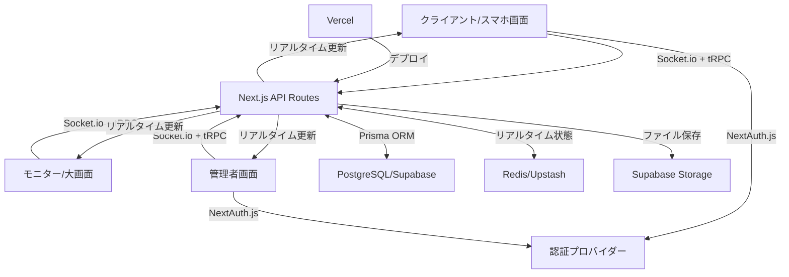
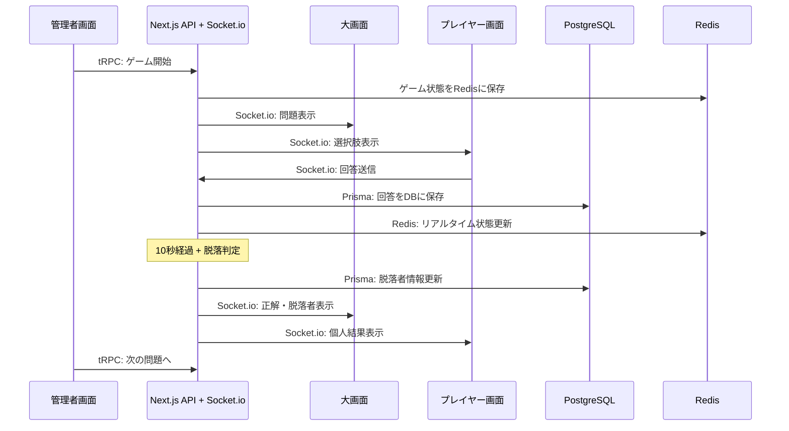

# 設計書：オールスター感謝祭風サバイバルクイズアプリケーション

## 概要

本設計書は、オールスター感謝祭風のサバイバルクイズアプリケーションの設計を詳細に記述したものです。このアプリケーションは、複数の参加者が脱落システムのクイズに挑戦し、最後の1人になるまで生き残りをかけて競い合うゲームです。

## アーキテクチャ

### 計画中の構成（配置の実現性はIssue #2で検証）

アプリケーションは以下の主要コンポーネントで構成されます：

#### フロントエンド

- **フレームワーク**: Next.js 15 (App Router)
- **UI**: React 18 + TypeScript
- **スタイリング**: Tailwind CSS + shadcn/ui
- **状態管理**: Zustand + React Query (TanStack Query)
- **リアルタイム通信**: Socket.io Client
- **認証**: NextAuth.js v5

#### バックエンド

- **フレームワーク**: Next.js API Routes (フルスタック構成)
- **リアルタイム**: Socket.io Server
- **認証**: NextAuth.js v5
- **バリデーション**: Zod
- **ORM**: Prisma

#### データベース・インフラ

- **メインDB**: PostgreSQL (Supabase)
- **リアルタイムDB**: Redis (Upstash)
- **ファイルストレージ**: Supabase Storage
- **デプロイ**: Vercel

#### 開発・品質管理

- **言語**: TypeScript (strict mode)
- **テスト**: Vitest + Testing Library
- **リンター**: ESLint + Prettier
- **型安全性**: tRPC (型安全なAPI)

### システム構成図

### アーキテクチャの利点

#### 1. フルスタックNext.js構成

- **統一された開発体験**: フロントエンドとバックエンドを同一プロジェクトで管理
- **型安全性**: tRPCによりフロントエンドからバックエンドまで完全な型安全性
- **パフォーマンス**: App Routerによる最適化されたレンダリング
- **デプロイの簡素化**: Vercelでのワンクリックデプロイ

#### 2. 現代的な状態管理

- **Zustand**: 軽量でシンプルな状態管理
- **React Query**: サーバー状態の効率的なキャッシュと同期
- **Redis**: リアルタイムゲーム状態の高速アクセス

#### 3. 型安全なAPI設計

- **tRPC**: エンドツーエンドの型安全性
- **Zod**: ランタイムバリデーションと型推論
- **Prisma**: 型安全なデータベースアクセス

### 通信フロー

## コンポーネントと機能

### 1. フロントエンド

#### 1.1 大画面（モニター）コンポーネント

- **問題表示画面**：問題文、10秒カウントダウンタイマー、選択肢表示
- **結果表示画面**：正解表示、回答者数表示、脱落者表示
- **ランキング画面**：最も遅い正解者（脱落者）表示
- **優勝者画面**：最終問題での最速正解者（優勝者）表示

#### 1.2 プレイヤー（スマホ）コンポーネント

- **ログイン画面**：NextAuth.js認証
- **待機画面**：ゲーム開始待ち
- **回答画面**：4つの選択肢ボタン
- **結果画面**：正解/不正解表示、生存/脱落状態表示
- **ゲームオーバー画面**：脱落理由表示
- **優勝画面**：優勝者表示

#### 1.3 管理者コンポーネント

- **問題管理画面**：問題の追加・編集・削除
- **ゲーム進行画面**：ゲーム開始、問題切り替え、最終問題設定
- **参加者管理画面**：参加者一覧、状態確認

### 2. バックエンド

#### 2.1 Socket.ioゲートウェイ

- **イベント処理**：各種イベントの送受信
- **ゲーム状態管理**：現在の問題、残り時間、参加者状態の管理
- **脱落判定ロジック**：不正解者、時間切れ、最も遅い正解者の脱落処理
- **優勝判定ロジック**：最終問題での最速正解者の判定

#### 2.2 APIエンドポイント

- **問題管理API**：問題のCRUD操作
- **ユーザー管理API**：ユーザー情報の取得・更新
- **ゲーム管理API**：ゲームセッションの作成・更新・削除

### 3. データベース

#### 3.1 PostgreSQLテーブル（Prismaスキーマ）

- **users**：ユーザー情報、認証状態、生存状態
- **questions**：問題文、選択肢、正解
- **answers**：ユーザーの回答、回答時間
- **games**：ゲームセッション情報、現在の問題、参加者リスト
- **game_participants**：ゲーム参加者の中間テーブル
- **sounds**：効果音、BGM情報

#### 3.2 Redisキャッシュ

- **ゲーム状態**：リアルタイムゲーム進行状況
- **参加者状態**：生存/脱落状態のキャッシュ
- **回答状況**：問題ごとの回答状況

## データモデル・状態遷移・通信契約（Issue #1で確定）

正本は [GAME_CONTRACT.md](../../../docs/GAME_CONTRACT.md)、型は `src/types/game.ts`。
内部GameStateと公開GameSnapshotを分離する。Questionは正解とtypeを含む内部データ、PublicQuestionはそれらを含まない公開データ。SubmitAnswerRequestにはplayerIdや自己申告時刻を含めず、本人はセッションから解決する。

状態は waiting → playing → closing → results → playing / finished。許可操作・例外・中止は正本の遷移表に従う。
10秒のサーバー締切は排他的。同着はサーバー受付連番で判定し、通常問題で正解者1人なら次問へ進む。最終問題の鐘は結果発表時のみ。

イベントのversionとsnapshotで再接続時の欠落・逆転を解消する。本人限定の回答確認応答と、部屋全体に送る回答数通知は分離する。結果発表前の正解・解説・最終フラグを送らない。

## エラーハンドリング

### 1. 接続エラー

- Socket.io接続が切断された場合、自動的に再接続を試みる
- 再接続時に現在のゲーム状態を同期する
- 長時間接続できない場合はエラーメッセージを表示

### 2. データ整合性エラー

- 回答データの不整合が発生した場合、管理者に通知
- Prismaのトランザクションを使用して、データの整合性を確保
- バックアップメカニズムを実装して、データ損失を防止

### 3. ユーザーエラー

- 不正な操作（複数回の回答など）を検出し、ブロック
- 回答送信失敗時の再試行メカニズム
- ユーザーフレンドリーなエラーメッセージ表示

## テスト戦略

### 1. ユニットテスト

- 各コンポーネントの単体テスト
- 脱落判定ロジックのテスト
- Socket.ioイベントハンドラのテスト

### 2. 統合テスト

- フロントエンドとバックエンドの連携テスト
- Socket.io通信のテスト
- Prisma操作のテスト

### 3. エンドツーエンドテスト

- 実際のゲームフローのシミュレーション
- 複数ユーザーでの同時接続テスト
- 脱落シナリオのテスト

## セキュリティ対策

### 1. 認証・認可

- NextAuth.js v5を使用したユーザー認証
- 管理者権限の厳格な管理
- セッションの有効期限設定

### 2. データ保護

- Supabase Row Level Security (RLS) の設定
- センシティブデータの暗号化
- 適切なアクセス制御

### 3. 通信セキュリティ

- HTTPS通信の強制
- WebSocketセキュリティの確保
- レート制限の実装

## パフォーマンス最適化

### 1. フロントエンド最適化

- コンポーネントの遅延ロード
- 画像・アセットの最適化
- キャッシュ戦略の実装

### 2. バックエンド最適化

- Socket.ioコネクションの効率的管理
- データベースクエリの最適化
- メモリ使用量の監視と最適化

### 3. スケーラビリティ

- 水平スケーリングのサポート
- 負荷分散の実装
- キャッシュレイヤーの導入

## 演出とエフェクト

### 1. 視覚効果

- 正解・不正解時のアニメーション
- 脱落演出（画面エフェクト）
- 優勝者発表の特別演出

### 2. 音響効果

- 正解・不正解音
- カウントダウン音
- 脱落音
- 最終問題の鐘の音
- 優勝ファンファーレ

### 3. タイミング制御

- 演出の適切なタイミング制御
- 画面遷移のスムーズなアニメーション
- 効果音と視覚効果の同期
